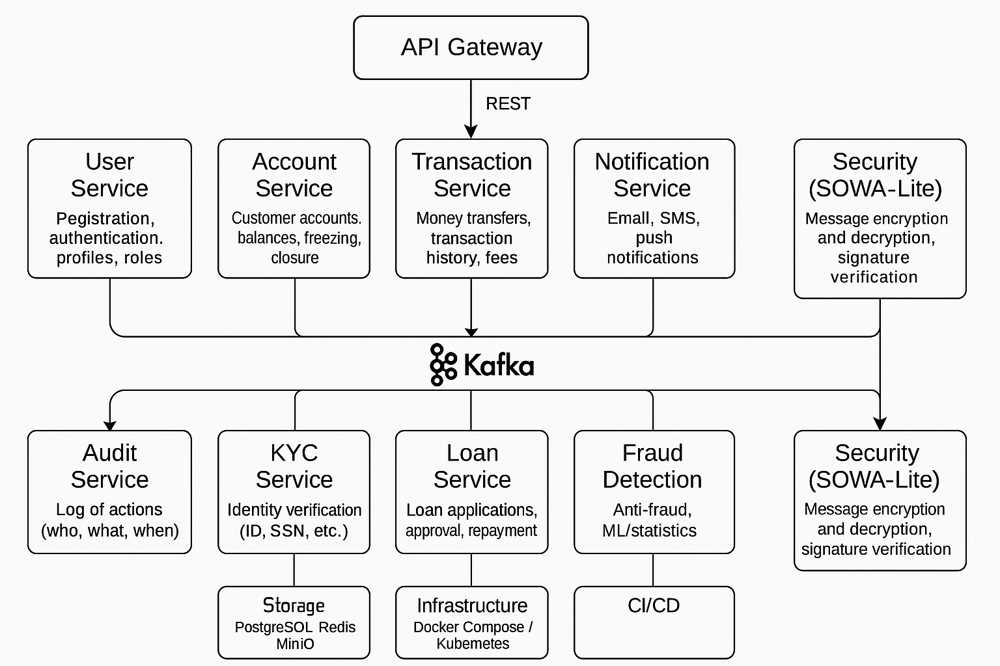

# 🏦 Bank App

Банковская система, построенная на Java 21 с использованием Spring Boot и Clean Architecture. Разрабатывается в рамках учебного проекта.

## 📚 Описание

Проект моделирует основные операции банковской системы:
- Управление пользователями и счетами
- Переводы между счетами
- Ведение истории транзакций
- Безопасность через JWT
- Построение микросервисной архитектуры (в будущем)

## 🔧 Технологии

- Java 21
- Spring Boot
- Spring Security
- Spring Data JPA
- PostgreSQL
- Gradle
- Docker (в перспективе)
- Clean Architecture

## 🏗️ Архитектура проекта

Архитектура следует принципам Clean Architecture:
- Domain — бизнес-логика и сущности
- Application — DTO, use cases, сервисы
- Infrastructure — безопасность, репозитории, конфиги
- Presentation — контроллеры

## 📂 Модули (будущие микросервисы)

- User Service
- Account Service
- Transaction Service
- Notification Service
- Audit Service
- KYC Service
- Loan Service
- Fraud Detection
- Security (SOWA-lite)
- API Gateway

## 🧭 Архитектура микросервисов



## 🚀 Как запустить

```bash
./gradlew bootRun

## 📚 Wiki-руководства

[manual](https://gitlab.com/katacademy-group/banking-projects/bank-app/-/wikis/%F0%9F%A7%91%E2%80%8D%F0%9F%92%BB-%D0%9A%D0%B0%D0%BA-%D0%BF%D0%B8%D1%81%D0%B0%D1%82%D1%8C-%D0%BA%D0%BE%D0%B4-%D0%B2-%D0%BF%D1%80%D0%BE%D0%B5%D0%BA%D1%82%D0%B5-Bank-App#-%D0%BE%D1%81%D0%BD%D0%BE%D0%B2%D0%BD%D1%8B%D0%B5-%D0%BF%D1%80%D0%B8%D0%BD%D1%86%D0%B8%D0%BF%D1%8B[])